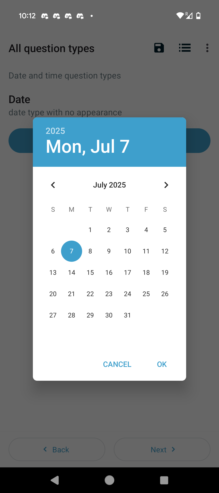

# ODK Collect

Simplified Explanation: Imagine a digital clipboard for surveys. ODK Collect is an Android app that lets you fill out surveys on your phone or tablet, even without internet. It can replace or augment paper forms, making data collection faster and more accurate.  At the end of data collection, the form is finalized and sent to a server.

## Advantages of ODK Collect versus paper-based collection
- Eliminates errors when transferring from paper to electronic database
- Real-time data-entry validation
- Reduces incomplete data collection (using required fields)
- Standardizes data entry (example date formats)

These are a few Examples of the type of data you can collect.  

### Choose a date from a calendar

### Choose one item   

### Choose multiple selections   

### Gather signatures  

## [How to Install ODK Collect](./install-odk-collect.md)

